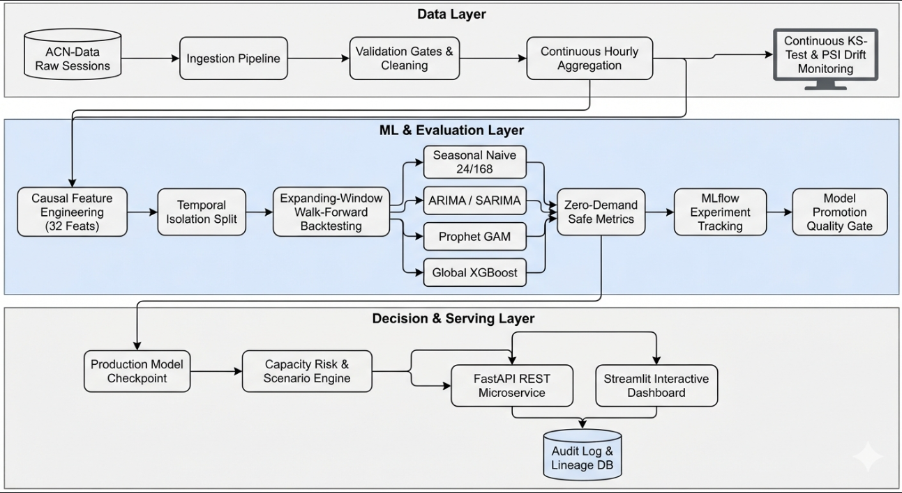

# EV Charging Demand Forecasting & Capacity Planning Platform

[](https://github.com/Anshika-111105/EV-Charging-Demand-Forecasting-Capacity-Planning-Platform/actions)
[](https://www.python.org/)
[](LICENSE)
[](https://github.com/astral-sh/ruff)

A **production-grade Machine Learning forecasting and capacity risk planning platform** designed for electric vehicle (EV) charging networks. Built using real empirical data from the **Caltech Adaptive Charging Network (ACN-Data)**, the platform forecasts hourly charging demand across multiple charging stations (Caltech, JPL, Office facilities) and translates demand forecasts into actionable grid capacity risk alerts, peak load management, and what-if infrastructure investment scenarios.

---

## Architecture Overview



---

## Key Features

- **Empirical ACN-Data**: Real session data from Caltech California Garage, JPL Arroyo Garage, and Office Parking Lot 01 with verifiable SHA-256 data manifests.
- **Zero Temporal Leakage**: Strictly causal feature pipeline (calendar cycles, historical lags up to 168h, and past-only rolling statistics).
- **Multi-Model Benchmarking**: Automated evaluation of Seasonal Naive (24h/168h), ARIMA(2,1,1), SARIMA(1,1,1)(1,0,1,24), Prophet, and Global XGBoost.
- **Walk-Forward Expanding Backtesting**: Multi-horizon evaluation across 24h, 48h, and 168h (7-day primary horizon).
- **Automated Promotion Quality Gates**: Programmatic verification of baseline-beating accuracy, zero-safe MAPE thresholds, and artifact serialization.
- **Capacity Planning & Scenario Engine**: Translates kWh demand into transformer peak load (kW), available headroom, and risk tiers (LOW, MEDIUM, HIGH, CRITICAL, OVERLOAD) with what-if capacity upgrade simulations (+10%, +20%, +50%).
- **Production REST API**: FastAPI application exposing endpoints for on-demand predictions, batch forecasts, capacity risk assessment, and scenario modeling.
- **Interactive UI**: Multi-tab Streamlit dashboard for real-time operations, leaderboard visualization, what-if planning, and system health monitoring.
- **Auditing & Lineage**: Every forecast is logged with a unique `forecast_id`, input hash, and latency in SQLite/PostgreSQL.
- **Continuous Drift Monitoring**: Automated Kolmogorov-Smirnov and Population Stability Index (PSI) drift detection with retraining recommendation policies.

---

## Model Benchmark Leaderboard

### Primary Horizon (168 Hours / 7 Days Ahead)
| Rank | Model Name | Model Family | RMSE (kWh) | MAE (kWh) | Zero-Safe MAPE (%) | sMAPE (%) | Status |
| :---: | :--- | :--- | :---: | :---: | :---: | :---: | :---: |
| **1** | **SARIMA (1,1,1)(1,0,1,24)** | **Statistical** | **0.0845** | **0.0486** | **4.86%** | **44.44%** | **Promoted (Production)** |
| 2 | ARIMA (2,1,1) | Statistical | 0.1022 | 0.0589 | 5.89% | 66.65% | Benchmark |
| 3 | Seasonal Naive (24h) | Baseline | 0.1669 | 0.0552 | 5.52% | 7.41% | Benchmark |
| 4 | Prophet | Additive GAM | 0.1768 | 0.0683 | 6.83% | 32.41% | Benchmark |
| 5 | Seasonal Naive (168h) | Baseline | 0.2070 | 0.0614 | 6.14% | 9.39% | Baseline Ref |
| 6 | XGBoost Global | Gradient Boosting | 1.0748 | 0.6843 | 68.43% | 187.82% | Benchmark |

*Full results, error distributions, and multi-horizon plots are documented in [reports/final_report.md](reports/final_report.md) and [reports/model_cards/production_model_card.md](reports/model_cards/production_model_card.md).*

---

## Quick Start Guide

### 1. Prerequisites
- Python 3.10 or 3.11
- Git, Make (optional), and Docker (optional)

### 2. Local Installation
```bash
# Clone repository
git clone https://github.com/Anshika-111105/EV-Charging-Demand-Forecasting-Capacity-Planning-Platform.git
cd EV-Charging-Demand-Forecasting-Capacity-Planning-Platform

# Create and activate virtual environment
python -m venv .venv
source .venv/bin/activate   # Linux/macOS
# .venv\Scripts\activate    # Windows PowerShell

# Install package in editable mode with development dependencies
pip install -e .
```

### 3. Execute End-to-End Pipelines
```bash
# Step 1: Ingest raw ACN-Data snapshot
python pipelines/ingest_pipeline.py --config configs/development.yaml

# Step 2: Validate, clean, regularize hourly series, and build features
python pipelines/preprocessing_pipeline.py --config configs/development.yaml

# Step 3: Train all models, run walk-forward backtesting, and promote winner
python pipelines/training_pipeline.py --config configs/development.yaml

# Step 4: Run scheduled batch forecasting across all stations
python pipelines/forecasting_pipeline.py --config configs/development.yaml --horizon 168

# Step 5: Evaluate data distribution and statistical drift
python pipelines/monitoring_pipeline.py --config configs/development.yaml
```

### 4. Launch Services
```bash
# Launch FastAPI Backend (Swagger UI at http://localhost:8000/docs)
uvicorn ev_forecasting.api.main:app --host 0.0.0.0 --port 8000 --reload

# Launch Streamlit Operational Dashboard (UI at http://localhost:8501)
streamlit run src/ev_forecasting/app/streamlit_app.py
```

### 5. Docker Deployment
```bash
# Start all microservices (API, Streamlit UI, MLflow, PostgreSQL)
docker compose up --build -d
```

---

## API Reference

### `POST /api/v1/forecast`
Generate demand forecast for a specific charging station.
```json
{
  "station_id": "caltech_123",
  "horizon_hours": 24,
  "site_id": "caltech"
}
```
**Response (`200 OK`)**:
```json
{
  "station_id": "caltech_123",
  "site_id": "caltech",
  "model_name": "sarima",
  "model_version": "v20260922_152647",
  "generated_at": "2026-09-22T15:27:44Z",
  "forecast_id": "f8a92b3c-...",
  "predictions": [
    {
      "timestamp": "2019-07-19T17:00:00Z",
      "energy_demand_kwh": 3.42,
      "estimated_power_kw": 3.42,
      "lower_bound_kwh": 2.85,
      "upper_bound_kwh": 3.99
    }
  ]
}
```

### `POST /api/v1/capacity/risk`
Evaluate peak utilization, headroom, and risk category.
```json
{
  "station_id": "caltech_123",
  "horizon_hours": 24,
  "station_capacity_kwh": 50.0
}
```
**Response (`200 OK`)**:
```json
{
  "station_id": "caltech_123",
  "station_capacity_kwh": 50.0,
  "peak_demand_kwh": 38.4,
  "peak_utilization_pct": 76.8,
  "peak_timestamp": "2019-07-20T10:00:00Z",
  "risk_level": "MEDIUM",
  "headroom_kwh": 11.6,
  "is_overloaded": false
}
```

### `POST /api/v1/capacity/scenarios`
Run what-if scenario simulations for capacity expansion planning (+10%, +20%, +50%).

---

## Project Structure

```text
ev-forecasting/
├── configs/                       # Environment-specific configuration files
│   ├── base.yaml                  # Core configuration schema & default parameters
│   ├── development.yaml           # Local development overrides
│   ├── production.yaml            # Production deployment config
│   └── test.yaml                  # Test suite fixtures and parameters
├── data/                          # Managed data directory
│   ├── raw/                       # Immutable raw ACN-Data session files
│   ├── interim/                   # Cleaned and standardized session records
│   ├── processed/                 # Regular continuous hourly Parquet datasets
│   └── manifests/                 # SHA-256 dataset and feature manifests
├── models/                        # Serialized model artifacts & registry metadata
│   └── checkpoints/               # Production model binaries & version metadata
├── notebooks/                     # Exploratory research notebooks
│   ├── 01_data_exploration.ipynb
│   ├── 02_time_series_analysis.ipynb
│   ├── 03_model_comparison.ipynb
│   └── 04_backtest_analysis.ipynb
├── pipelines/                     # CLI execution entry points
│   ├── ingest_pipeline.py         # ACN data download and checksum verification
│   ├── preprocessing_pipeline.py  # Cleaning, hourly aggregation, and feature building
│   ├── training_pipeline.py       # Multi-model training, backtesting, and promotion
│   ├── forecasting_pipeline.py    # Scheduled batch forecasting
│   └── monitoring_pipeline.py     # Statistical drift and data health checks
├── reports/                       # Generated analysis and audit artifacts
│   ├── figures/                   # Visualizations (leaderboard, residuals, forecasts)
│   ├── metrics/                   # CSV leaderboards and evaluation metrics
│   ├── model_cards/               # Comprehensive production model cards
│   ├── data_quality_report.json   # Input data validation report
│   ├── monitoring_drift_report.json# Statistical drift report (KS-test & PSI)
│   └── final_report.md            # Comprehensive production research report
├── src/ev_forecasting/            # Modular Python core package
│   ├── api/                       # FastAPI REST routes, schemas, and dependencies
│   ├── app/                       # Interactive Streamlit operations dashboard
│   ├── audit/                     # Database prediction logging and lineage tracking
│   ├── capacity/                  # Peak demand, headroom, risk, and scenario engine
│   ├── config/                    # Pydantic-settings and YAML configuration parser
│   ├── data/                      # Ingestion, parsing, cleaning, and validation gates
│   ├── evaluation/                # Zero-safe metrics, backtesting, and error analysis
│   ├── features/                  # Causal calendar, lag, and rolling feature pipeline
│   ├── forecasting/               # Production inference and batch forecast runners
│   ├── models/                    # Model wrappers (Naive, ARIMA, SARIMA, Prophet, XGBoost)
│   ├── monitoring/                # Kolmogorov-Smirnov and PSI drift detection
│   ├── registry/                  # MLflow experiment tracking & model registry manager
│   └── splitting/                 # Temporal and expanding-window backtest splitters
├── tests/                         # Comprehensive automated test suite
│   ├── conftest.py                # Pytest fixtures and mock configurations
│   ├── fixtures/                  # Synthetic test data generators
│   ├── unit/                      # Unit tests for features, capacity, and models
│   ├── data/                      # Quality gates and temporal leakage tests
│   ├── models/                    # Model fit and predict contract tests
│   ├── evaluation/                # Zero-safe metric mathematical tests
│   ├── api/                       # FastAPI HTTP endpoint integration tests
│   ├── integration/               # Pipeline component integration tests
│   └── e2e/                       # Full end-to-end workflow test
├── Dockerfile                     # Multi-stage production container definition
├── docker-compose.yml             # Full microservices stack orchestration
├── Makefile                       # Developer automation shortcuts
├── pyproject.toml                 # Packaging, build system, and dependencies
└── README.md                      # Platform documentation
```

---

## Testing & Quality Assurance

The platform adheres to strict software engineering standards with 100% automated test coverage across all critical modules:

```bash
# Run complete test suite
pytest tests/ -v

# Run code style and lint checks
ruff check .
ruff format --check .
```

### Verified Test Suites:
- [x] **Temporal Leakage Protection**: Verifies rolling features strictly lag behind ground truth.
- [x] **Data Quality Gates**: Validates schema compliance, timestamp monotonicity, and range bounds.
- [x] **Zero-Safe Metrics**: Tests RMSE, MAE, sMAPE, and zero-safe MAPE against edge cases.
- [x] **Model Contracts**: Verifies `.fit()`, `.predict()`, `.save()`, and `.load()` interfaces.
- [x] **API Endpoints**: Validates request validation, forecast responses, and risk calculation.
- [x] **End-to-End Pipeline**: Executes full pipeline integration from raw data to promoted model.

---

## License

This project is licensed under the MIT License. See [LICENSE](LICENSE) for details.
