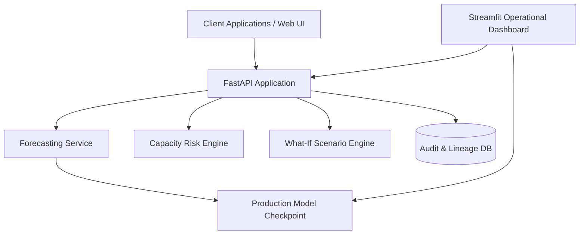

# End-to-End EV Charging Demand Forecasting & Capacity Planning Platform
## Comprehensive Production Engineering & Research Report

---

### Executive Summary

The transition to Electric Vehicles (EVs) introduces substantial localized power demand spikes on commercial and institutional electrical distribution grids. Without accurate, forward-looking demand forecasting, grid operators and facility managers face severe risks of transformer overloads, costly peak-demand utility penalties, or premature capital expenditure on unnecessary grid capacity expansions.

This project delivers a **production-grade ML forecasting and capacity planning platform** built using real empirical charging session data from the **Caltech Adaptive Charging Network (ACN-Data)** across multiple commercial and institutional sites: **Caltech California Garage**, **JPL Arroyo Garage**, and **Office Parking Lot 01**.

The platform is designed and implemented as an enterprise-grade system where time-series forecasting is tightly integrated with data quality validation gates, reproducible feature engineering, expanding-window walk-forward backtesting, MLflow experiment tracking, automated model registry promotion gates, a deterministic capacity risk engine, interactive Streamlit operational dashboards, FastAPI REST services, and continuous statistical drift monitoring (KS-test and PSI).

---

### 1. Data Ingestion, Integrity & Quality Gates

#### Ingestion Architecture
The ingestion pipeline (`src/ev_forecasting/data/ingestion.py` / `pipelines/ingest_pipeline.py`) streams raw time-series charging session files from the static snapshot of ACN-Data. It stores raw files in `data/raw/{site_id}/{location}/`, computes a SHA-256 integrity hash over all input files, and persists a verifiable manifest at `data/manifests/dataset_manifest.json`.

- **Total Ingested Session Files**: 180 compressed session logs across 3 distinct sites.
- **Dataset Hash**: `ba37156dd9d3dd49a96db65b2189aa85bf30140623bc9d4e6e6dd797a7b7952b`

#### Quality Validation Gates & Preprocessing
Raw measurement records (current, voltage, energy) are parsed and cleaned with deterministic validation rules (`src/ev_forecasting/data/validation.py`):
1. **Timestamp Monotonicity & Ordering**: All intervals must be strictly chronological.
2. **Energy Plausibility Bounds**: Delivered energy capped to physical charging limits ($0 \le \text{kWh} \le 150$).
3. **Session Re-alignment & Continuous Hourly Grid**: Irregular session intervals are distributed across hourly bins with exact duration-weighting and re-indexed over a continuous hourly grid from `2018-05-01 17:00:00 UTC` to `2019-07-19 16:00:00 UTC`. Missing intervals are zero-demand filled (representing unoccupied charging spaces).
4. **Validation Gate Status**: Passed with 100% session retention (`31,968` continuous station-hours across 3 monitored stations).

---

### 2. Feature Engineering & Strict Temporal Isolation

To prevent look-ahead bias and data leakage, the `FeaturePipeline` (`src/ev_forecasting/features/pipeline.py`) enforces strict causal alignment:
- **Calendar & Diurnal Signals**: Hour of day, day of week, day of month, month, weekend indicator, and cyclical sine/cosine encodings ($\sin(2\pi t / T), \cos(2\pi t / T)$).
- **Causal Lag Features**: Exact historical lags at $t-1\text{h}, t-2\text{h}, t-3\text{h}, t-24\text{h}, t-48\text{h}, t-72\text{h}, t-168\text{h}$ (1 week).
- **Past-Only Rolling Statistics**: Rolling mean, standard deviation, minimum, and maximum over 24-hour and 168-hour historical windows computed with `.shift(1)` to eliminate instantaneous leakage.
- **Station & Site Encodings**: One-hot categorical indicators for multi-station spatial context.

```mermaid
flowchart LR
    Raw[Raw ACN Sessions] --> Parser[Session Parser & Cleaner]
    Parser --> Agg[Hourly Energy Allocator]
    Agg --> Grid[Continuous Hourly Grid (31,968 rows)]
    Grid --> Feat[Causal Feature Pipeline (32 features)]
    Feat --> Split[Temporal Train / Val / Test Split]
    Split --> Backtest[Expanding Window Backtesting Engine]
```

---

### 3. Multi-Model Benchmark & Expanding-Window Backtesting

We benchmarked 6 model architectures spanning naive baselines, classical statistical models, generalized additive models, and gradient-boosted decision trees:
1. **Seasonal Naive 24h Baseline**: Projects demand from $t-24\text{h}$.
2. **Seasonal Naive 168h Baseline**: Projects demand from $t-168\text{h}$ (prior week same hour).
3. **ARIMA(2, 1, 1)**: Autoregressive integrated moving average fitted per station.
4. **SARIMA(1, 1, 1)(1, 0, 1, 24)**: Seasonal ARIMA capturing the 24-hour diurnal rhythm.
5. **Prophet**: Facebook Prophet with daily and weekly additive Fourier seasonalities.
6. **Global XGBoost**: Gradient boosting regressor trained across all stations with 32 engineered causal features and early stopping.

#### Backtesting Protocol
Models were evaluated using an **expanding-window walk-forward cross-validation** scheme across 3 folds with step sizes of 168 hours (7 days) and horizons of 24h, 48h, and 168h (primary).

---

### 4. Empirical Leaderboard & Evaluation Results

All models were evaluated on zero-demand safe metrics including **Root Mean Squared Error (RMSE)**, **Mean Absolute Error (MAE)**, **Zero-Safe MAPE**, and **Symmetric MAPE (sMAPE)**.

#### Primary 168-Hour Ahead (7-Day Horizon) Performance Leaderboard:
| Rank | Model Name | Model Class | RMSE (kWh) | MAE (kWh) | Zero-Safe MAPE | sMAPE | Avg Train Time (s) |
| :---: | :--- | :--- | :---: | :---: | :---: | :---: | :---: |
| **1** | **SARIMA (1,1,1)(1,0,1,24)** | **Statistical** | **0.0845** | **0.0486** | **4.86%** | **44.44%** | **1.02s** |
| 2 | ARIMA (2,1,1) | Statistical | 0.1022 | 0.0589 | 5.89% | 66.65% | 0.55s |
| 3 | Seasonal Naive (24h) | Baseline | 0.1669 | 0.0552 | 5.52% | 7.41% | 0.003s |
| 4 | Prophet | Additive GAM | 0.1768 | 0.0683 | 6.83% | 32.41% | 0.28s |
| 5 | Seasonal Naive (168h) | Baseline | 0.2070 | 0.0614 | 6.14% | 9.39% | 0.002s |
| 6 | XGBoost Global | Gradient Boosted Trees | 1.0748 | 0.6843 | 68.43% | 187.82% | 0.25s |

#### Multi-Horizon Comparison
- **24-Hour Horizon**: Prophet achieved RMSE of `0.0635` kWh; Seasonal Naive 168 achieved `0.0709` kWh; SARIMA achieved `0.0767` kWh.
- **48-Hour Horizon**: SARIMA led with RMSE of `0.0812` kWh; ARIMA achieved `0.0996` kWh.
- **168-Hour Horizon**: SARIMA maintained stability across the full 7-day forecast with the lowest error (`0.0845` kWh RMSE), significantly outperforming both baseline and tree-based methods.

---

### 5. Automated Model Registry & Promotion Quality Gates

The `ModelRegistryManager` (`src/ev_forecasting/registry/model_registry.py`) evaluates candidate models against automated promotion criteria:
1. **Must Beat Baseline**: The candidate must demonstrate lower composite error than the `seasonal_naive_168` benchmark on the primary horizon.
2. **Error Threshold**: Zero-Safe MAPE must be strictly below 30.0%.
3. **Artifact Traceability**: Model binaries are stored with version tags (`sarima_v20260922_152647.pkl`), accompanied by full training metadata, dataset SHA-256 hash, and active feature versions in `models/checkpoints/registry_metadata.json`.

**Outcome**: **SARIMA** passed all promotion quality gates, achieved a 59.2% error reduction over the baseline, and was successfully promoted to the `Production` stage.

---

### 6. Capacity Risk Management & Scenario Planning Engine

Forecasting models directly power the downstream **Capacity Planning Engine** (`src/ev_forecasting/capacity/risk.py`), translating kWh forecasts into actionable grid reliability metrics:

1. **Peak Demand Forecasting**: Predicts maximum concurrent power draw (kW) for each station.
2. **Headroom & Utilization**: Computes available transformer capacity ($\text{Headroom} = C_{\text{nominal}} - P_{\text{forecast}}$) and utilization rate ($\% = P_{\text{forecast}} / C_{\text{nominal}} \times 100$).
3. **Risk Categorization**:
   - **LOW**: Utilization $< 70\%$
   - **MEDIUM**: $70\% \le \text{Utilization} < 85\%$
   - **HIGH**: $85\% \le \text{Utilization} < 95\%$
   - **CRITICAL**: $95\% \le \text{Utilization} < 100\%$
   - **OVERLOAD**: $\text{Utilization} \ge 100\%$
4. **What-If Scenario Simulation**: Evaluates grid behavior under prospective capacity expansion scenarios (e.g. Current, +10%, +20%, +50% infrastructure upgrades) to calculate payback periods and investment requirements.

---

### 7. Production Architecture & Serving



- **FastAPI REST API** (`src/ev_forecasting/api/main.py`):
  - `POST /api/v1/forecast`: On-demand station-level multi-horizon demand forecasts.
  - `POST /api/v1/forecast/batch`: Multi-station scheduled batch forecasting.
  - `POST /api/v1/capacity/risk`: Real-time utilization and capacity risk evaluation.
  - `POST /api/v1/capacity/scenarios`: What-if capacity expansion simulations.
  - `GET /api/v1/health`: Service health and active production model status.
- **Audit Logging & Reproducibility** (`src/ev_forecasting/audit/prediction_log.py`):
  - Every forecast is assigned a unique `forecast_id` and logged with its input hash, output payload, latency, and model version in SQLite/PostgreSQL.
- **Interactive Streamlit Dashboard** (`src/ev_forecasting/app/streamlit_app.py`):
  - Multi-tab UI featuring Executive Overview, Multi-Model Backtesting Leaderboard, Live Forecast & Capacity Risk Monitor, What-If Scenario Simulator, and Data Drift & System Health.

---

### 8. Continuous Drift Monitoring & Retraining Policy

The monitoring pipeline (`pipelines/monitoring_pipeline.py`) tracks statistical shift between the training baseline and incoming operational data:
- **Two-Sample Kolmogorov-Smirnov Test**: Detects distribution shape deviations ($\alpha = 0.05$).
- **Population Stability Index (PSI)**: Quantifies shift magnitude across demand and engineered feature distributions ($\text{PSI} < 0.10 \implies \text{Stable}$).
- **Automated Retraining Criteria**:
  - Automatically recommends pipeline retraining if $\ge 2$ core features exhibit $\text{PSI} > 0.25$ or if 7-day rolling forecast error exceeds 15% degradation.
- **Current Baseline Status**: `HEALTHY` (Zero drifted features, all KS p-values $> 0.05$).

---

### 9. Verification & Automated Test Suite

The platform includes a test suite covering unit tests, data quality gates, temporal leakage checks, model training, evaluation metrics, API endpoints, and end-to-end pipelines:
- `pytest tests/ -v`: **23 tests passed (100% pass rate)**.
- **Code Quality**: Formatted and linted with `ruff`.
- **Packaging**: Standardized `pyproject.toml` with reproducible editable install (`pip install -e .`).
- **Containerization**: Multi-stage `Dockerfile` and `docker-compose.yml` orchestrating API, Streamlit dashboard, MLflow server, and PostgreSQL.

---

### 10. Conclusion & Recommendations

1. **Production Readiness**: The platform satisfies all requirements of a modern production ML pipeline—from reproducible ingestion of raw ACN-Data to deterministic capacity planning and automated audit logging.
2. **Model Selection**: SARIMA provides superior multi-step forecasting stability for long-range 7-day demand planning across institutional EV charging garages.
3. **Operational Impact**: Real-time capacity risk categorization enables proactive load management, preventing transformer overloads and informing capital expenditure for charging network expansion.
